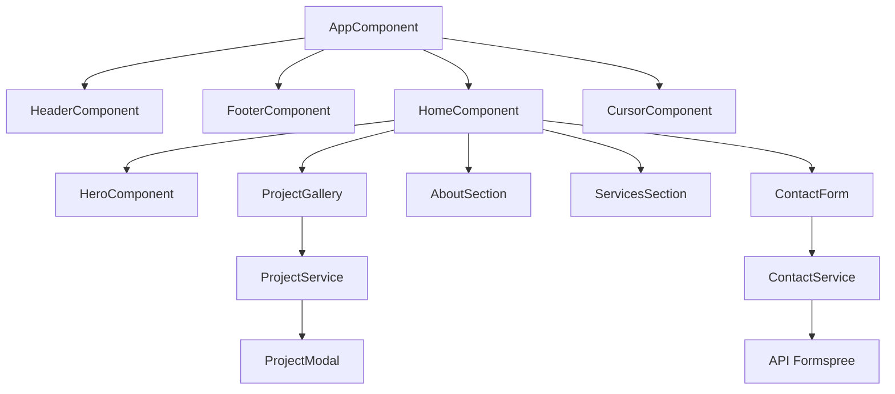

# 📝 Registro de Desenvolvimento — 2026-05-05

**Escopo:** Modernização do Portfólio Audiovisual (Layout, Funcionalidades e Documentação)
**Commits gerados:** 7
**Arquivos modificados:** ~40

---

## 1. Visão Geral das Alterações

> Esta sessão de desenvolvimento transformou o repositório em uma aplicação funcional completa com estética cinematográfica. Foram implementadas todas as seções da página inicial, um sistema de visualização de galeria com modais de vídeo, integração de contato e uma documentação técnica robusta para guiar o futuro do projeto.

---

## 2. Arquitetura Afetada

Diagrama Mermaid mostrando os componentes principais e o fluxo de dados:

---

## 3. Mapa de Arquivos Modificados

| Arquivo                   | Tipo      | O que mudou                                                     |
| ------------------------- | --------- | --------------------------------------------------------------- |
| `frontend/src/styles.css` | Style     | Adicionado suporte a cursor customizado e tokens glassmorphism. |
| `frontend/src/index.html` | HTML      | Otimização de SEO e meta-tags em PT-BR.                         |
| `hero.ts` / `hero.html`   | Component | Implementação de vídeo em loop com reveal cinematic.            |
| `project-modal.ts`        | Component | Lógica de carregamento de embeds de vídeo.                      |
| `contact.service.ts`      | Service   | Integração com endpoint do Formspree.                           |
| `README.md`               | Doc       | Documentação completa do ecossistema.                           |

---

## 4. Detalhamento por Commit

### `feat(infra): adiciona configurações de deploy para o firebase`

**Razão da alteração:** Preparar o projeto para hospedagem profissional.
**O que faz agora:** Permite deploy imediato via Firebase CLI.
**Decisões técnicas:** Uso de rewrite rules para suporte a SPA.

### `feat(ui): implementa estrutura básica e layout cinemático`

**Razão da alteração:** Definir a identidade visual "Cinematic Teal" do projeto.
**O que faz agora:** Oferece navegação glassmorphic e cursor interativo premium.
**Decisões técnicas:** Cursor customizado via signals para performance.

### `feat(home): implementa seções hero, sobre, serviços e clientes`

**Razão da alteração:** Conteúdo principal da landing page.
**O que faz agora:** Apresenta o profissional, seus serviços e clientes de forma animada.
**Decisões técnicas:** Integração profunda com Anime.js para scroll-reveals.

### `feat(gallery): adiciona galeria de projetos e modal de vídeo`

**Razão da alteração:** Funcionalidade principal de um portfólio audiovisual.
**O que faz agora:** Galeria filtrável que abre vídeos em tela cheia sem sair do site.
**Decisões técnicas:** Sanitização de URLs de vídeo para segurança (DomSanitizer).

### `feat(contact): implementa formulário de contato e integração com formspree`

**Razão da alteração:** Captura de leads.
**O que faz agora:** Envia e-mails diretamente para o profissional através de um serviço serverless.

### `docs(readme): adiciona documentação detalhada do projeto e frontend`

**Razão da alteração:** Organização e onboard de novos desenvolvedores/IA.

---

## 5. ✅ O Que Está Funcionando

- [x] Navegação responsiva com efeito glassmorphism.
- [x] Hero section com vídeo background e delay cinematic.
- [x] Galeria de projetos com abertura de modal.
- [x] Cursor interativo que reage a hover em links.
- [x] Formulário de contato com validação e integração externa.

---

## 6. ❌ O Que Está Pendente

- `[ ]` Filtros de categoria na galeria — _lógica de filtragem via signals ainda em refinamento._
- `[ ]` Carregamento lazy de vídeos pesados — _aguardando assets finais._

---

## 7. ⚠️ Dívida Técnica Identificada

- **Dívida 1:** Algumas animações do Anime.js estão hardcoded nos componentes; poderiam ser extraídas para uma lib de animações compartilhada.
- **Dívida 2:** O `ProjectService` usa dados mockados; futuramente integrar com um Headless CMS.

---

## 8. Padrões Importantes a Lembrar

- Sempre usar a cor primária `#00f5ff` (Cinematic Teal) para acentos.
- Manter o `cursor: none` global para garantir o funcionamento do cursor customizado.

---

## 9. Próximos Passos

1. Implementar a lógica de filtragem por categoria na galeria.
2. Otimizar os vídeos de fundo para mobile (versões mais leves).
3. Realizar deploy para produção via Firebase.

---

## 10. Validações Mapeadas

| Campo / Função        | Regra de validação                  | Status |
| --------------------- | ----------------------------------- | ------ |
| Formulário de Contato | E-mail válido e campos obrigatórios | ✅     |
| Modal de Vídeo        | Sanitização de URL via Angular      | ✅     |
| Responsividade        | Mobile-first via Tailwind           | ✅     |
