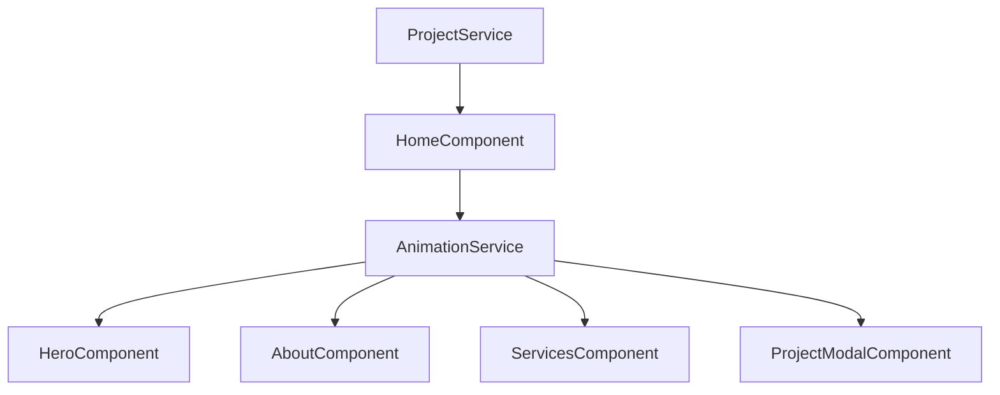

# 📝 Registro de Desenvolvimento — 2026-05-06

**Escopo:** Refinamento de Galeria, Otimização Mobile e Limpeza de Dívida Técnica (Animações)
**Commits gerados:** 4
**Arquivos modificados:** 10

---

## 1. Visão Geral das Alterações

> Implementação de um serviço centralizado de animações utilizando Anime.js para resolver dívidas técnicas de código hardcoded. Refinamento da lógica de filtragem da galeria com o uso de Signals e Effects do Angular para transições mais suaves. Otimização de performance no Hero section para dispositivos móveis através de estratégias de fallback de imagem em substituição a iframes pesados.

---

## 2. Arquitetura Afetada

---

## 3. Mapa de Arquivos Modificados

| Arquivo                 | Tipo      | O que mudou                                                 |
| ----------------------- | --------- | ----------------------------------------------------------- |
| `animation.service.ts`  | Service   | Criação do serviço centralizado de animações.               |
| `home.ts`               | Component | Refinamento da filtragem com `effect` e `AnimationService`. |
| `hero.ts` / `hero.html` | Component | Lógica de detecção de mobile e fallback de imagem.          |
| `about.ts`              | Component | Refatoração para usar `AnimationService`.                   |
| `services.ts`           | Component | Refatoração para usar `AnimationService`.                   |
| `project-modal.ts`      | Component | Refatoração para usar `AnimationService`.                   |
| `project.ts`            | Service   | Documentação de planos para Headless CMS.                   |
| `gallery.animations.ts` | Animation | Arquivo deletado (lógica movida para o serviço).            |

---

## 4. Detalhamento por Commit

### `refactor(animations): extrai lógica do Anime.js para AnimationService e resolve dívida técnica`

**Razão da alteração:**
Extrair animações hardcoded que estavam dificultando a manutenção e consistência visual.

**O que faz agora:**
Fornece uma API única para animações cinemáticas (stagger, fade, hero entrance) através de um serviço injetável.

**Decisões técnicas:**
Uso de Singleton Service para evitar múltiplas instâncias do Anime.js e padronizar durações/easings.

**Arquivos envolvidos:**

- `animation.service.ts` — implementação da lógica central.
- `about.ts`, `services.ts`, `hero.ts`, `project-modal.ts` — refatoração para injeção do serviço.

### `feat(gallery): aprimora filtragem por categoria com signals e effects`

**Razão da alteração:**
A filtragem anterior era manual e não reagia de forma fluida a mudanças de estado.

**O que faz agora:**
Utiliza `effect` para monitorar a lista filtrada e disparar automaticamente o stagger de entrada dos cards.

**Arquivos envolvidos:**

- `home.ts` — implementação do effect e integração com o novo serviço.

### `feat(hero): otimiza performance em dispositivos móveis com fallback de imagem`

**Razão da alteração:**
Iframes do YouTube como background impactam negativamente o LCP e performance em mobile.

**O que faz agora:**
Exibe uma imagem estática otimizada em telas menores, reservando o vídeo apenas para desktop.

**Arquivos envolvidos:**

- `hero.html` — condicional `@if (isMobile())`.
- `hero.ts` — detecção de breakpoint via window resize.

---

## 5. ✅ O Que Está Funcionando

- [x] Filtragem de galeria reativa e animada.
- [x] Background otimizado (Imagem em Mobile, Vídeo em Desktop).
- [x] Sistema centralizado de animações cinemáticas.
- [x] Modal de projeto com animações suaves de entrada.

---

## 6. ❌ O Que Está Pendente

- `[ ]` Carregamento lazy de vídeos pesados — _aguardando assets finais para implementação de IntersectionObserver nos vídeos._
- `[ ]` Integração com Headless CMS — _planejado para fase 2 (atualmente usando dados mockados)._

---

## 7. ⚠️ Dívida Técnica Identificada

- **Dívida 1:** O `ProjectService` ainda contém dados mockados diretamente no código; ideal seria mover para um arquivo JSON ou constante externa até a integração com CMS.
- **Dívida 2:** Alguns estilos do modal em `project-modal.css` poderiam ser movidos para variáveis globais.

---

## 8. Padrões Importantes a Lembrar

- **Animações:** Sempre usar o `AnimationService` para novas animações para manter a consistência de easing (`easeOutQuart`).
- **Performance:** Manter a verificação `isMobile()` para elementos pesados de interface.

---

## 9. Próximos Passos

1. Configurar integração com CMS (Contentful ou Strapi).
2. Adicionar suporte a múltiplos vídeos/galeria de imagens dentro do modal.
3. Implementar skeleton loaders para a galeria durante trocas de categoria.

---

## 10. Validações Mapeadas

| Campo / Função         | Regra de validação                              | Status |
| ---------------------- | ----------------------------------------------- | ------ |
| Filtragem via Signals  | Atualização imediata do DOM e animação          | ✅     |
| Responsividade Hero    | Troca de asset baseada em breakpoint            | ✅     |
| Centralização Anime.js | Ausência de imports de `animejs` em componentes | ✅     |
